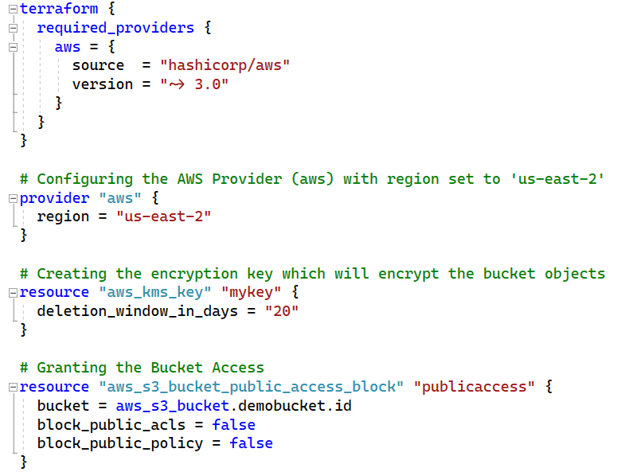

[marketplace]: https://marketplace.visualstudio.com/items?itemName=MadsKristensen.Terraform
[vsixgallery]: http://vsixgallery.com/extension/Terraform.d40d8829-581f-472c-aa5d-6514d5dbdde9/
[repo]:https://github.com/madskristensen/Terraform

# Terraform language support

Download this extension from the [Visual Studio Marketplace][marketplace]
or get the [CI build][vsixgallery].

--------------------------------------

Basic language support for Terraform files (.tf and .tfvars) including syntax highlighting, comment/uncomment, brace completion, and more.

## How can I help?
If you enjoy using the extension, please give it a ★★★★★ rating on the [Visual Studio Marketplace][marketplace].

Should you encounter bugs or if you have feature requests, head on over to the [GitHub repo][repo] to open an issue if one doesn't already exist.

Pull requests are also very welcome, since I can't always get around to fixing all bugs myself. This is a personal passion project, so my time is limited.

Another way to help out is to [sponsor me on GitHub](https://github.com/sponsors/madskristensen).